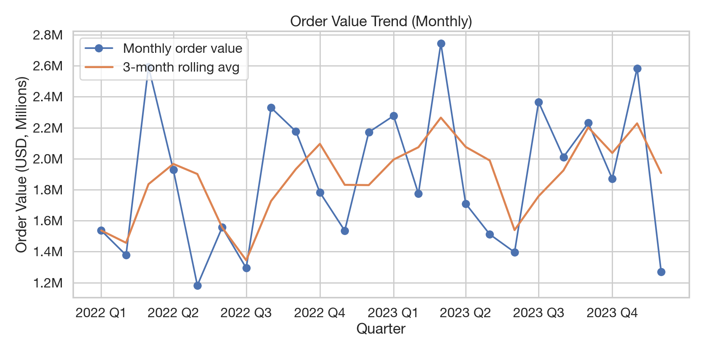
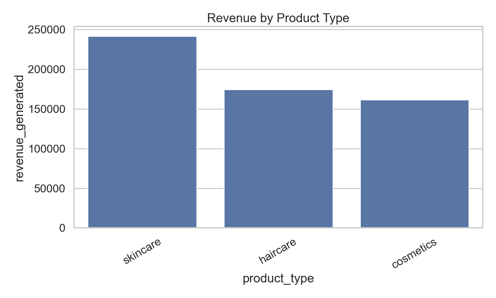
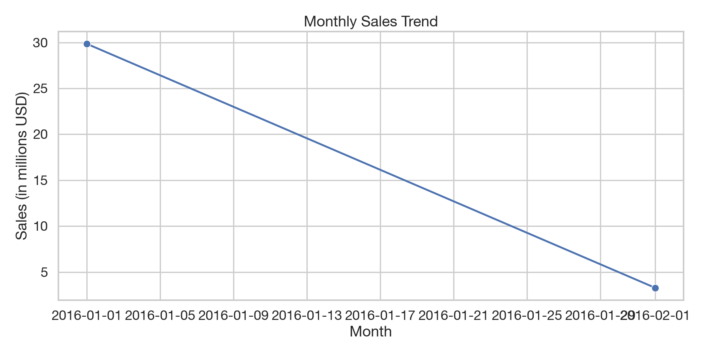

# Operation Analytics Portfolio

## Overview
This repository contains executive-ready analytics cases with reproducible pipelines, BI-ready exports, and decision-oriented summaries.

### Cases
- `cases/procurement-kpi-analysis`: Supplier performance, compliance, and delivery timing KPIs.
- `cases/supply-chain-analysis`: Driver analysis for revenue, costs, and quality without time series.
- `cases/inventory_analysis`: Inventory optimization (EOQ, reorder points, ABC, turnover).

### Screenshots





### Quick Run
```bash
python -m shared.src.run_case --case company-purchasing-dataset
python -m shared.src.run_case --case procurement-kpi-analysis
python -m shared.src.run_case --case supply-chain-analysis
python -m shared.src.run_case --case inventory_analysis
```

## Data Availability
Large raw datasets are excluded from GitHub. Each case README includes a `data_sample/` folder and instructions to run with full data.

## BI-Ready Exports
Each case generates a star schema and flat pivot file:
- `exports/bi_fact_<case>.csv` + `.parquet`
- `exports/dim_*.csv` + `.parquet`
- `exports/flat_<case>_pivot_ready.csv`
- `exports/data_dictionary.csv`
- `exports/star_schema.md`

### Conventions
- `snake_case` columns
- Surrogate keys for dimensions (`*_key`)
- `date_key` (YYYYMMDD int) for time joins
- Numeric measures typed as int/float with no currency symbols

## Ethics & Security
See `DATA_ETHICS.md` and `SECURITY.md` for data handling, privacy, and security expectations.

## Portfolio Summary
See `reports/PORTFOLIO_EXEC_SUMMARY.md` for cross-case highlights and recommendations.

## Repository Structure
```
operation-analytics/
  cases/
  shared/
  reports/
```
