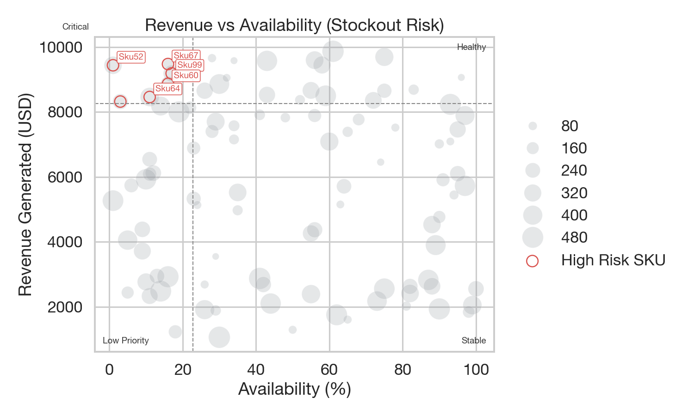
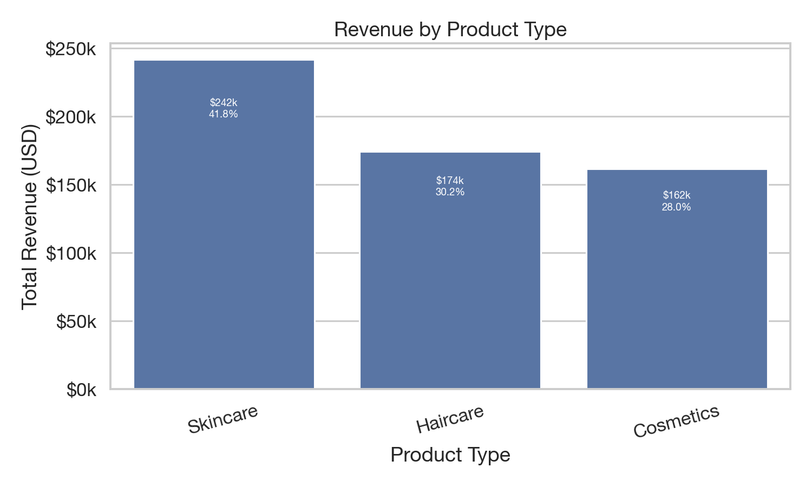
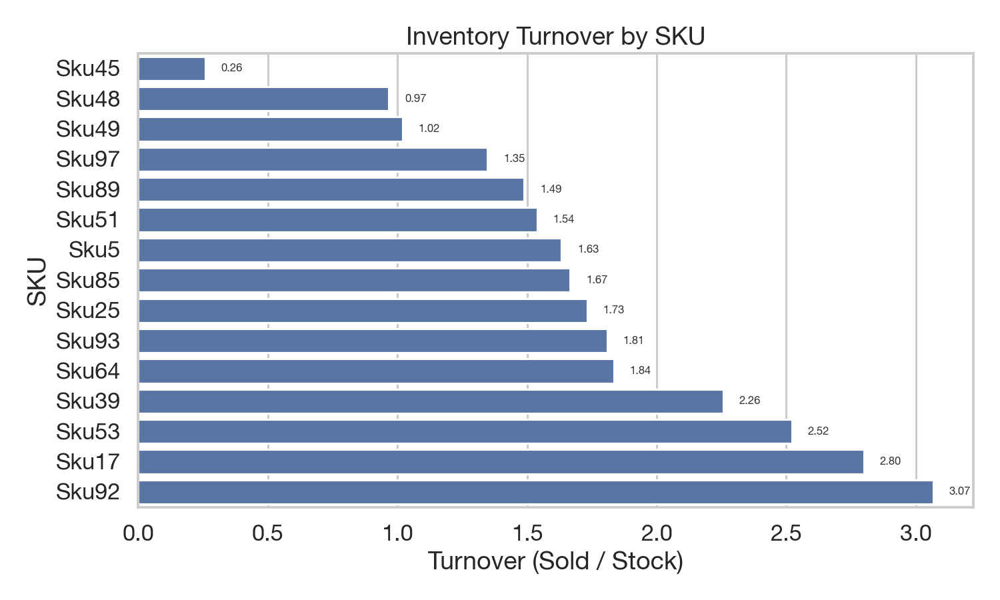
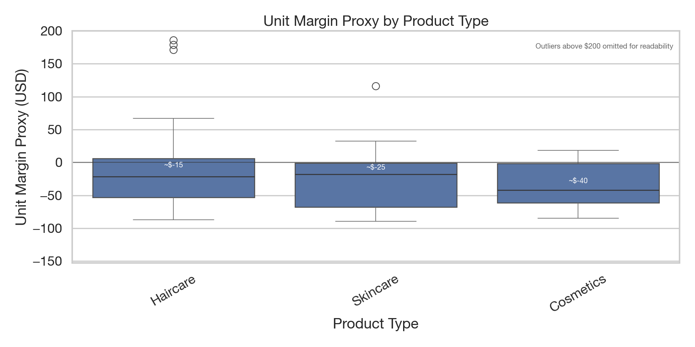
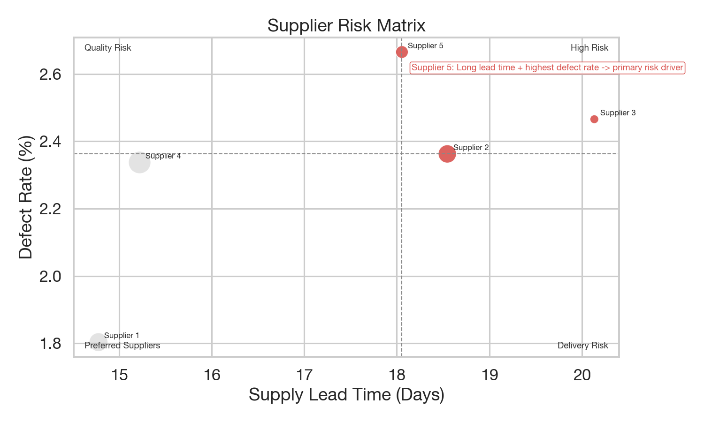
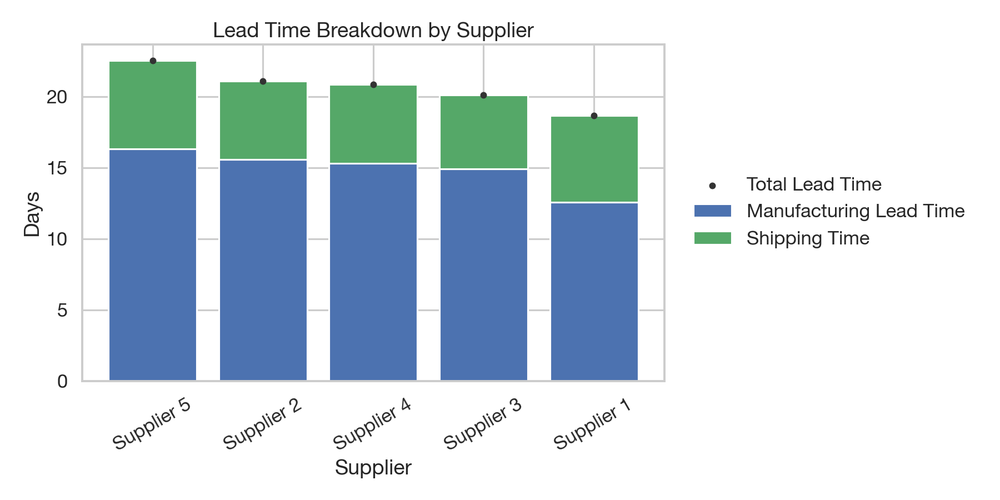
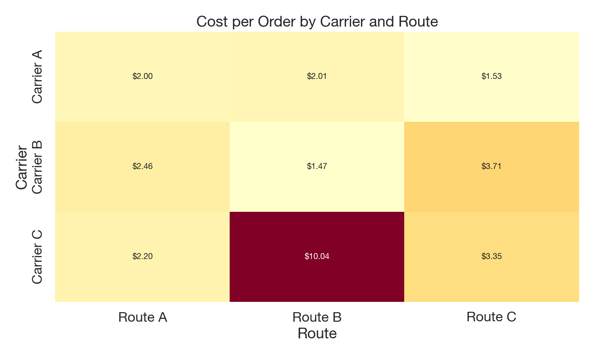
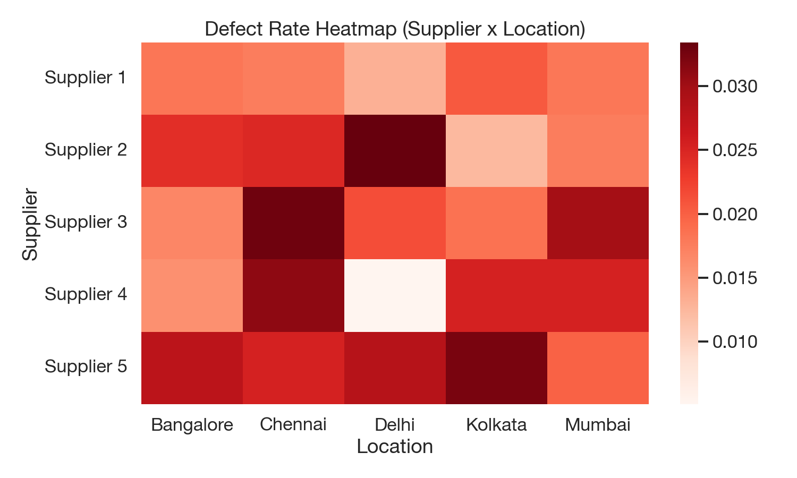
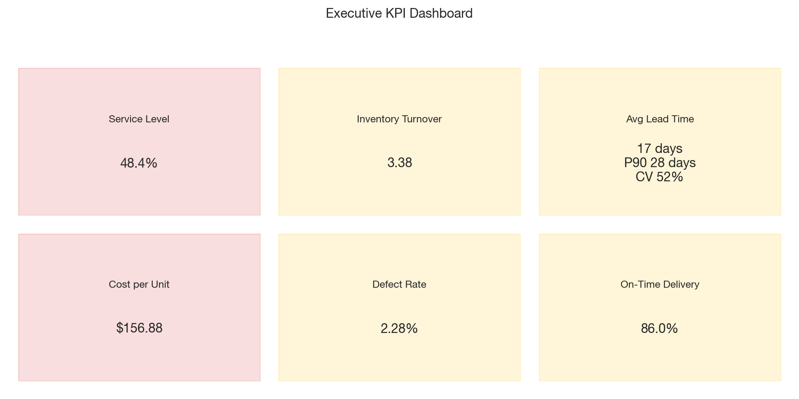

# Executive Summary — Supply Chain Analytics & Optimization

## Executive Snapshot
- Coverage: 100 SKUs, 3 product types, 5 suppliers, 3 carriers, 4 transportation modes.
- Total revenue: $577.6K. Total cost proxy (manufacturing + logistics): $2.78M.
- Service level (availability): 48.4%.
- Inventory turnover (median revenue ÷ inventory value proxy): 3.38.
- Avg lead time: 17.1 days (P90 28 days, CV 52%).
- Cost per unit (proxy): $156.88.
- Defect rate: 2.28%.
- On-time delivery proxy: 86.0%.

## Headline Findings
- Revenue concentration is high: A items (60 SKUs) generate 80.5% of revenue; B adds 14.7%; C contributes 4.8%.
- Supplier concentration is material: Supplier 1 contributes 27.3% of revenue and Supplier 2 adds 21.7%; the remaining suppliers contribute 51.0%.
- Stockout risk is concentrated: revenue P75 ≥ $8.25K and availability P25 ≤ 22.8% flag SKU67, SKU52, SKU99, SKU60, and SKU64 as critical.
- Overstock risk is visible: SKU45, SKU48, SKU49, SKU97, and SKU89 have the weakest turnover (0.26–1.49).
- Lead time risk is supplier-driven: Supplier 5 (22.6 days) and Supplier 2 (21.1 days) have the highest total lead time, dominated by manufacturing time.
- Logistics trade-off is weak: shipping time vs cost correlation is ~0.05. Road is fastest and low cost, while Air and Rail are higher cost without a speed advantage over Road.
- Quality risk is concentrated: Supplier 2 in Delhi shows the highest defect hotspot (3.34%), and the top 4 suppliers account for ~85.9% of defect cost risk.
- Margin proxy is negative across categories; Haircare shows the widest dispersion, indicating the largest pricing or cost inconsistency.

## Priority Actions (Ranked)
1. Protect A-class SKUs and top stockout-risk SKUs with higher ROP and safety stock.
2. Reduce capital tied in low-turnover SKUs via order-quantity resets and SKU rationalization.
3. Launch supplier improvement plans for Supplier 2, 3, and 5 focused on manufacturing lead time and defect reduction.
4. Shift non-critical lanes from Air and Rail to Road or Sea where service impact is minimal.
5. Focus quality mitigation on the top 4 defect-cost suppliers and the Supplier 2–Delhi hotspot.

## Detailed Analysis & Recommendations

**Core Question**
Where are we losing money, time, or service — and what should we fix first?

### 1. Revenue vs Availability vs Stock Risk (Demand Fulfillment)
**Key insights**
- High-revenue SKUs with low availability indicate lost sales potential.
- A small set of SKUs shows stock-heavy positions with weak demand signals.

**High-revenue, low-availability SKUs (stockout risk)**
| SKU | Revenue (USD) | Avg Availability (%) | Avg Stock |
| --- | --- | --- | --- |
| SKU67 | 9,473.80 | 16.0 | 12 |
| SKU52 | 9,435.76 | 1.0 | 64 |
| SKU99 | 9,185.19 | 17.0 | 55 |
| SKU60 | 8,864.08 | 16.0 | 41 |
| SKU64 | 8,458.73 | 11.0 | 73 |

**Low-turnover SKUs (overstock risk)**
| SKU | Turnover (Sold/Stock) | Avg Stock | Avg Demand |
| --- | --- | --- | --- |
| SKU45 | 0.26 | 93 | 24 |
| SKU48 | 0.97 | 30 | 29 |
| SKU49 | 1.02 | 97 | 99 |
| SKU97 | 1.35 | 46 | 62 |
| SKU89 | 1.49 | 90 | 134 |

**Decisions enabled**
- Adjust reorder points and safety stock for high-impact SKUs.
- Reallocate stock from low-turnover SKUs to high-value items.

**Chart notes**
- Bubble size reflects stock levels; neutral bubbles reduce clutter, with high‑risk SKUs highlighted in red.
- Quadrant labels turn the chart into a prioritization matrix.

### 1.1 Price Bands — Where Revenue Concentrates

**Key takeaways**
- Top revenue bands are $0–10 (~$81.6k), $10–20 (~$72.4k), and $90–100 (~$70.4k), totaling ~38.9% of revenue.
- The weakest band is $40–50 (~$21.1k), indicating softer performance in mid‑price SKUs.

**Implications**
- Protect the low‑price volume drivers while tightening margin controls.
- Review mid‑price SKUs for bundling, promotion, or discontinuation if margin or turnover is weak.

### 1.2 Revenue Mix by Product Type

**Key takeaways**
- Skincare generates 41.8% of revenue, Haircare 30.2%, and Cosmetics 28.0%.

### 2. Inventory Efficiency & Working Capital
**Key insights**
- ABC classification shows revenue concentration: 60 A-class SKUs generate 80.5% of revenue.
- Fast movers (e.g., SKU34, SKU47, SKU78) should get service-level protection.
- Slow movers (SKU45, SKU48, SKU49) are candidates for order quantity reduction or clearance.
Insight: ~60% of SKUs generate ~80% of revenue — tight control of A‑items is critical.

### 2.1 Margin Dispersion by Product Type

Haircare shows the widest margin dispersion and highest upside, indicating pricing or cost inconsistency across SKUs. Skincare is the most stable category with lower volatility, making it suitable for forecasting. Cosmetics sits in between, with moderate downside risk and limited upside.

**Decisions enabled**
- Segment inventory policy by ABC class (A = protect, B = optimize, C = minimize).
- Reduce excess inventory to free working capital.

### 3. Supplier Performance & Risk Scorecard
**Key insights**
- Supplier risk is concentrated in a few vendors with long lead times and higher defect rates.
- Defect cost risk is highest for Supplier 4 and Supplier 2 due to cost exposure.

**Tier definitions (for the Pareto chart)**
- Tier-1 Supplier A: the single highest-revenue supplier.
- Strategic Supplier B: the second-highest-revenue supplier.
- Long-Tail Supplier C: all remaining suppliers grouped together.

**Top supplier risk (lead time + defect rate)**
| Supplier | Avg Lead Time (Days) | Defect Rate (%) |
| --- | --- | --- |
| Supplier 3 | 20.1 | 2.47 |
| Supplier 5 | 18.1 | 2.67 |
| Supplier 2 | 18.5 | 2.36 |

**Top defect cost risk**
| Supplier | Defect Cost Risk (USD) |
| --- | --- |
| Supplier 4 | 16,459.99 |
| Supplier 2 | 13,787.22 |
| Supplier 1 | 13,599.75 |

**How to read the matrix**
- Quadrants label the risk type (High Risk, Quality Risk, Delivery Risk, Preferred Suppliers).
- Bubble size represents business exposure (spend or volume).
- High‑risk suppliers are highlighted for immediate action.

**Decisions enabled**
- Supplier consolidation and dual-sourcing for high-risk vendors.
- Targeted quality improvement and lead-time commitments in contracts.

### 4. Logistics & Transportation Cost Optimization
**Key insights**
- Cost vs speed correlation is weak (r≈0.05), suggesting optimization opportunities by mode and lane.
- Air is fastest but most expensive; Sea is cheapest but slowest.

**Mode trade-off snapshot**
| Mode | Avg Ship Time (Days) | Avg Ship Cost per Order (USD) |
| --- | --- | --- |
| Air | 5.1 | 6.02 |
| Road | 4.7 | 5.54 |
| Rail | 6.6 | 5.47 |
| Sea | 7.1 | 4.97 |

**Definition**
- Shipping cost represents the cost to ship one order (or one SKU batch) via the selected transportation mode.

**Decisions enabled**
- Shift low-priority lanes away from Air to Road or Sea.
- Prioritize lanes with high cost-per-order for carrier negotiations.

### 5. Quality Impact & Hidden Cost Analysis
**Key insights**
- Average defect rate is 2.28%.
- Haircare has the highest defect rate; skincare drives the most defect cost risk.
- Defect cost exposure is concentrated in a small supplier set.

**Quality target**
- Target defect rate is set at 2.0%, aligned to the KPI threshold used in the dashboard (benchmark for mature supplier quality performance).

**Decisions enabled**
- Focus quality improvement on Pareto suppliers and high-defect product types.
- Quantify defect-related rework or scrap savings in business cases.

### 6. Executive KPI Summary
**KPI snapshot**
- Service level (availability): 48.4%
- Inventory turnover (median proxy): 3.38
- Avg lead time: 17.1 days (P90 28 days, CV 52%)
- Cost per unit (proxy): $156.88
- Defect rate: 2.28%
- On-time delivery proxy: 86.0%

### Recommended Roadmap (Prioritized)
1. Protect A-class and stockout-risk SKUs with stronger replenishment settings.
2. Reduce exposure in low-turnover SKUs; align order quantities with demand.
3. Address Supplier 3/5 lead time and quality risk; prioritize Supplier 4/2 defect-cost reduction.
4. Rebalance transportation modes to cut cost without service degradation.
5. Target quality improvements in haircare and high-cost suppliers for fastest ROI.

### Assumptions & Data Notes
- No explicit date/time column, so analysis is cross-sectional.
- Inventory turnover is a proxy (units sold ÷ stock level), not a time-based turnover.
- Cost per unit and defect cost are proxies derived from manufacturing and logistics inputs.
