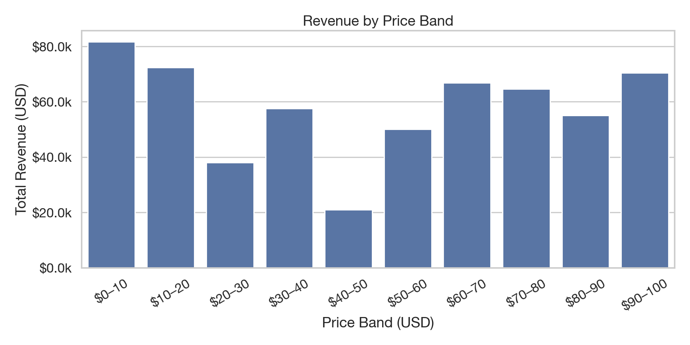
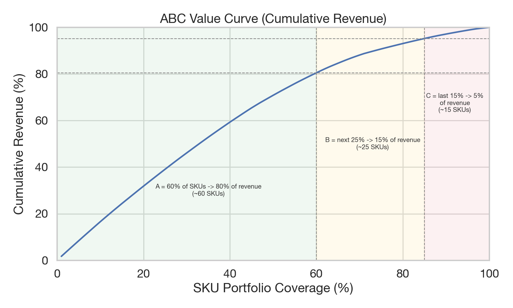
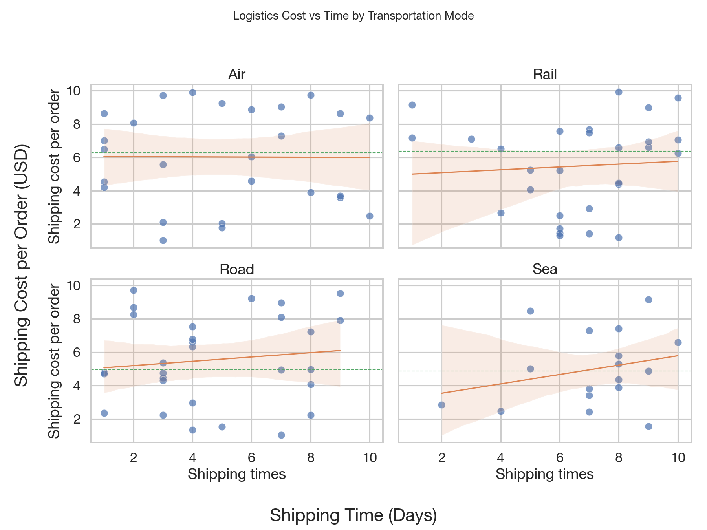
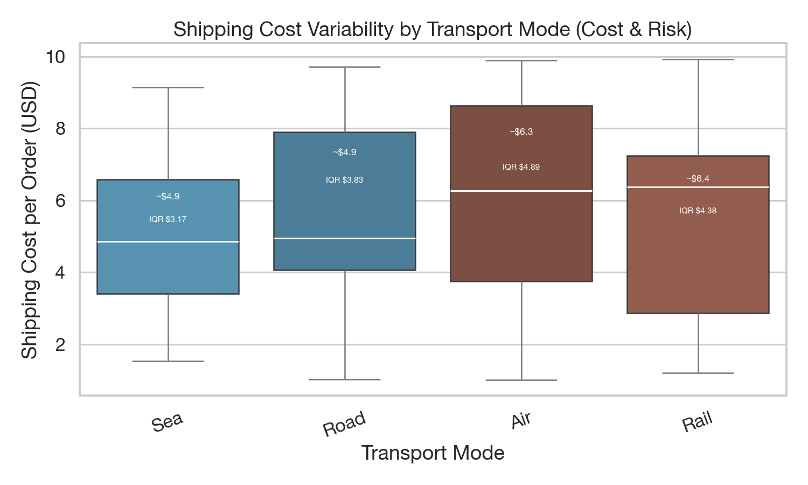
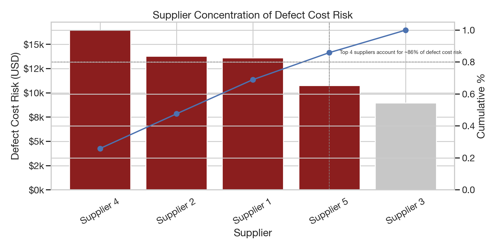
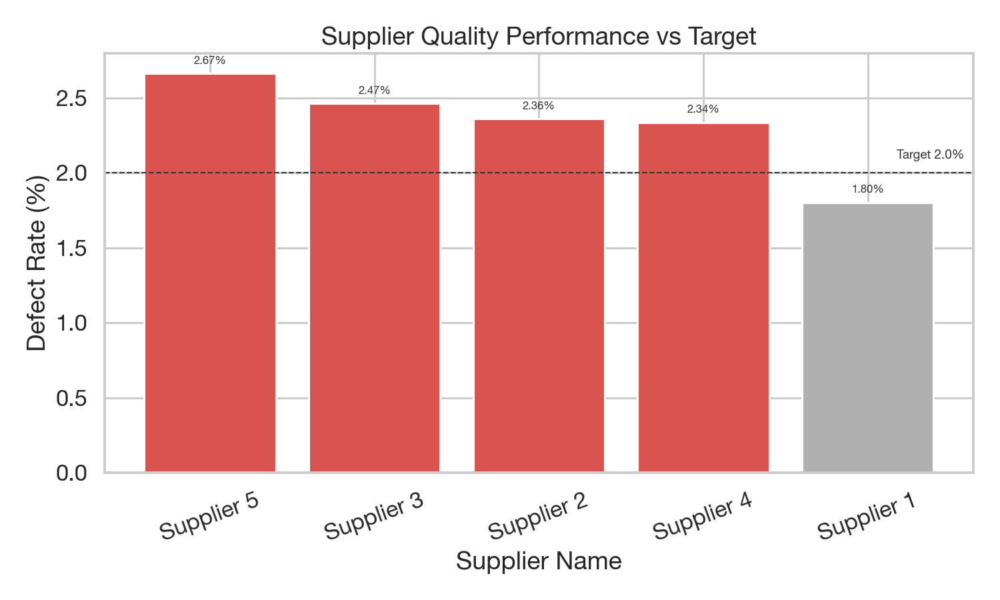

# Executive Supply Chain Performance & Optimization Report

## Core Question
Where are we losing money, time, or service — and what should we fix first?

## 1. Revenue vs Availability vs Stock Risk (Demand Fulfillment)
**Key insights**
- High-revenue SKUs with low availability indicate lost sales potential.
- A small set of SKUs shows stock-heavy positions with weak demand signals.

**High-revenue, low-availability SKUs (stockout risk)**
| SKU | Revenue (USD) | Avg Availability (%) | Avg Stock |
| --- | --- | --- | --- |
| SKU67 | 9,473.80 | 16.0 | 12 |
| SKU52 | 9,435.76 | 1.0 | 64 |
| SKU60 | 8,864.08 | 16.0 | 41 |

**Low-turnover SKUs (overstock risk)**
| SKU | Turnover (Sold/Stock) | Avg Stock | Avg Demand |
| --- | --- | --- | --- |
| SKU45 | 0.26 | 93 | 24 |
| SKU48 | 0.97 | 30 | 29 |
| SKU49 | 1.02 | 97 | 99 |
| SKU97 | 1.35 | 46 | 62 |
| SKU89 | 1.49 | 90 | 134 |

**Decisions enabled**
- Adjust reorder points and safety stock for high-impact SKUs.
- Reallocate stock from low-turnover SKUs to high-value items.

**Chart notes**
- Bubble size reflects stock levels; neutral bubbles reduce clutter, with high‑risk SKUs highlighted in red.
- Quadrant labels turn the chart into a prioritization matrix.

## 1.1 Price Bands — Where Revenue Concentrates

**Key takeaways**
- Top revenue bands are $0–10 (~$81.6k), $10–20 (~$72.4k), and $90–100 (~$70.4k), totaling ~38.9% of revenue.
- The weakest band is $40–50 (~$21.1k), indicating softer performance in mid‑price SKUs.

**Implications**
- Protect the low‑price volume drivers while tightening margin controls.
- Review mid‑price SKUs for bundling, promotion, or discontinuation if margin/turnover is weak.

## 1.2 Revenue Mix by Product Type

## 2. Inventory Efficiency & Working Capital
**Key insights**
- ABC classification shows revenue concentration: 59 A-class SKUs generate ~79.6% of revenue.
- Fast movers (e.g., SKU34, SKU47, SKU78) should get service-level protection.
- Slow movers (SKU45, SKU48, SKU49) are candidates for order quantity reduction or clearance.
 - Insight: ~60% of SKUs generate ~80% of revenue — tight control of A‑items is critical.

## 2.1 Margin Dispersion by Product Type

Haircare shows the widest margin dispersion and highest upside, indicating pricing or cost inconsistency across SKUs. Skincare is the most stable category with lower volatility, making it suitable for forecasting. Cosmetics sits in between, with moderate downside risk and limited upside.

**Decisions enabled**
- Segment inventory policy by ABC class (A = protect, B = optimize, C = minimize).
- Reduce excess inventory to free working capital.

## 3. Supplier Performance & Risk Scorecard
**Key insights**
- Supplier risk is concentrated in a few vendors with long lead times and higher defect rates.
- Defect cost risk is highest for Supplier 4 and Supplier 2 due to cost exposure.

**Tier definitions (for the Pareto chart)**
- Tier-1 Supplier A: the single highest-revenue supplier.
- Strategic Supplier B: the second-highest-revenue supplier.
- Long-Tail Supplier C: all remaining suppliers grouped together.

**Top supplier risk (lead time + defect rate)**
| Supplier | Avg Lead Time (Days) | Defect Rate (%) |
| --- | --- | --- |
| Supplier 3 | 20.1 | 2.47 |
| Supplier 5 | 18.1 | 2.67 |
| Supplier 2 | 18.5 | 2.36 |

**Top defect cost risk**
| Supplier | Defect Cost Risk (USD) |
| --- | --- |
| Supplier 4 | 16,459.99 |
| Supplier 2 | 13,787.22 |
| Supplier 1 | 13,599.75 |

**How to read the matrix**
- Quadrants label the risk type (High Risk, Quality Risk, Delivery Risk, Preferred Suppliers).
- Bubble size represents business exposure (spend/volume).
- High‑risk suppliers are highlighted for immediate action.

**Decisions enabled**
- Supplier consolidation and dual-sourcing for high-risk vendors.
- Targeted quality improvement and lead-time commitments in contracts.

## 4. Logistics & Transportation Cost Optimization
**Key insights**
- Cost vs speed correlation is weak (r≈0.05), suggesting optimization opportunities by mode and lane.
- Air is fastest but most expensive; Sea is cheapest but slowest.

**Mode trade-off snapshot**
| Mode | Avg Ship Time (Days) | Avg Ship Cost per Order (USD) |
| --- | --- | --- |
| Air | 5.1 | 6.02 |
| Road | 4.7 | 5.54 |
| Rail | 6.6 | 5.47 |
| Sea | 7.1 | 4.97 |

**Definition**
- Shipping cost represents the cost to ship one order (or one SKU batch) via the selected transportation mode.

**Decisions enabled**
- Shift low-priority lanes away from Air to Road/Sea.
- Prioritize lanes with high cost-per-unit for carrier negotiations.

## 5. Quality Impact & Hidden Cost Analysis
**Key insights**
- Average defect rate is 2.28%.
- Haircare has the highest defect rate; skincare drives the most defect cost risk.
- Defect cost exposure is concentrated in a small supplier set.

**Quality target**
- Target defect rate is set at 2.0%, aligned to the KPI threshold used in the dashboard (benchmark for mature supplier quality performance).

**Decisions enabled**
- Focus quality improvement on Pareto suppliers and high-defect product types.
- Quantify defect-related rework/scrap savings in business cases.

## 6. Executive KPI Summary
**KPI snapshot**
- Service level (availability): 48.4%
- Inventory turnover (median proxy): 8.69
- Avg lead time: 17.1 days (P90 28 days, CV 52%)
- Cost per unit (proxy): $156.88
- Defect rate: 2.28%
- On-time delivery proxy: 86.0%

## Recommended Roadmap (Prioritized)
1. Protect A-class and stockout-risk SKUs with stronger replenishment settings.
2. Reduce exposure in low-turnover SKUs; align order quantities with demand.
3. Address Supplier 3/5 lead time and quality risk; prioritize Supplier 4/2 defect-cost reduction.
4. Rebalance transportation modes to cut cost without service degradation.
5. Target quality improvements in haircare and high-cost suppliers for fastest ROI.

## Assumptions & Data Notes
- No explicit date/time column, so analysis is cross-sectional.
- Inventory turnover is a proxy (units sold ÷ stock level), not a time-based turnover.
- Cost per unit and defect cost are proxies derived from manufacturing/logistics inputs.
